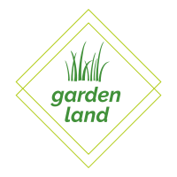

# Landing Page Projet (**_Garden Land_**)

## Table of Content
- [Landing Page Projet (**_Garden Land_**)](#landing-page-projet-garden-land)
  - [Table of Content](#table-of-content)
    - [**Garden Land**](#garden-land)
    - [**The Design**](#the-design)
    - [**The Development**](#the-development)
    - [**The Attribution Copyrights**](#the-attribution-copyrights)

### **Garden Land** 
is imaginary company sellind seeds and different plants for public

### **The Design**
it's a simple, acceptable and consist of 5 section which are: 
1. _About us section_ 
2. _Products_
   * Talking about different products that company offers
3. _Gallery_ 
   * Offers different images for different products
4. _Blog_
   * Has many articles helping you start your projects
5. _Contact_
   * Offers simple contact form to ask any question or making an offer

### **The Development**
The Page has been developed as follow

1. The Navigation will be visible always on scroll.
2. Navigation is built dynamically as an unordered list.
3. When section near top of viewport the section become active and its  style will change to highlight that activity. 
4. The navigation link related to active section will change its style also to make it clear that this section is the active one right now.
5. The Scroll will travel smoothly to the targeted section when user click on navigation links.
6. The scroll will disappear after 2 second of inactivity.
7. Scroll to top Button has been added that’s only visible when the user scrolls below the fold of the page.
8. Every Section has collapsible button.
9. On smaller screen the logo whill change its style on scroll so it can be visible when section become active.
   

### **The Attribution Copyrights**

* The Garden Land Logo
    made by [FreeLogoDesign](https://www.freelogodesign.org/)
* The Background Video
    by [fauxels](https://www.pexels.com/@fauxels?utm_content=attributionCopyText&utm_medium=referral&utm_source=pexels) from [Pexels](https://www.pexels.com/video/a-woman-touching-the-leaves-of-the-plants-in-a-green-house-3251845/)
* The icons from [Font Awesome Library](https://fontawesome.com/icons?d=gallery)
* The Gallery Images
  * seeds of change by [Joshua Lanzarini](https://unsplash.com/@jlanzarini?utm_source=unsplash&utm_medium=referral&utm_content=creditCopyText) on [Unsplash](https://unsplash.com/s/photos/seeds?utm_source=unsplash&utm_medium=referral&utm_content=creditCopyText)
  * variety of assorted-color beans by [Maddi Bazzocco](https://unsplash.com/@maddibazzocco?utm_source=unsplash&utm_medium=referral&utm_content=creditCopyText) on [Unsplash](https://unsplash.com/s/photos/seeds?utm_source=unsplash&utm_medium=referral&utm_content=creditCopyText)
  * brown almond nut by [chuttersnap](https://unsplash.com/@chuttersnap?utm_source=unsplash&utm_medium=referral&utm_content=creditCopyText) on [Unsplash](https://unsplash.com/s/photos/seeds?utm_source=unsplash&utm_medium=referral&utm_content=creditCopyText)
  * six leafy vegetables by [Angèle Kamp](https://unsplash.com/@angelekamp?utm_source=unsplash&utm_medium=referral&utm_content=creditCopyText) on [Unsplash](https://unsplash.com/s/photos/herbs?utm_source=unsplash&utm_medium=referral&utm_content=creditCopyText)
  * five gray spoons filled with assorted-color powders near chilli by [Calum Lewis](https://unsplash.com/@calumlewis?utm_source=unsplash&utm_medium=referral&utm_content=creditCopyText) on [Unsplash](https://unsplash.com/s/photos/herbs?utm_source=unsplash&utm_medium=referral&utm_content=creditCopyText)
  * green vegetables on brown wicker basket by [v2osk](https://unsplash.com/@v2osk?utm_source=unsplash&utm_medium=referral&utm_content=creditCopyText) on [Unsplash](https://unsplash.com/s/photos/herbs?utm_source=unsplash&utm_medium=referral&utm_content=creditCopyText)
  * shallow focus photography of white-and-pink petaled flowers by [Kwang Mathurosemontri](https://unsplash.com/@gemini_zucha89?utm_source=unsplash&utm_medium=referral&utm_content=creditCopyText) on [Unsplash](https://unsplash.com/?utm_source=unsplash&utm_medium=referral&utm_content=creditCopyText)
  * selective focus photography of pink petaled flower by [Andrew Small](https://unsplash.com/@andsmall?utm_source=unsplash&utm_medium=referral&utm_content=creditCopyText) on [Unsplash](https://unsplash.com/s/photos/flower?utm_source=unsplash&utm_medium=referral&utm_content=creditCopyText)
  * bed on pink peony flowers by [Miroslava](https://unsplash.com/@miroslava?utm_source=unsplash&utm_medium=referral&utm_content=creditCopyText) on [Unsplash](https://unsplash.com/s/photos/flower?utm_source=unsplash&utm_medium=referral&utm_content=creditCopyText)
  * round red fruits by [Macu ic](https://unsplash.com/@macu_ic?utm_source=unsplash&utm_medium=referral&utm_content=creditCopyText) on [Unsplash](https://unsplash.com/s/photos/fruit-tree?utm_source=unsplash&utm_medium=referral&utm_content=creditCopyText)
  * blueberry plant by [Amy Chen](https://unsplash.com/@spdumb2025?utm_source=unsplash&utm_medium=referral&utm_content=creditCopyText) on [Unsplash](https://unsplash.com/s/photos/fruit-tree?utm_source=unsplash&utm_medium=referral&utm_content=creditCopyText)
  * unharvested ripe peach fruits at daytime by [Ian Baldwin](https://unsplash.com/@ianebaldwin?utm_source=unsplash&utm_medium=referral&utm_content=creditCopyText) on [Unsplash](https://unsplash.com/s/photos/fruit-tree?utm_source=unsplash&utm_medium=referral&utm_content=creditCopyText)

